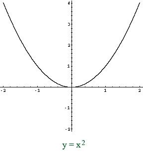

[![MIT License][license-shield]][license-url]


<br />
<p align="center">
  <a href="https://github.com/mQwand/SolveEquation/">
    
  </a>

  <h3 align="center">SolveEquation</h3>

  <p align="center">
    Простая и небольшая программа для решения квадратных уравнений.
    <br />
    <a href="https://github.com/mQwand/SolveEquation"><strong>Список файлов »</strong></a>
    <br />
    <br />
    <a href="https://github.com/mQwand/SolveEquation/blob/main/solvefunctions.c">Код функций решения уравнения </a>
  </p>
</p>


<details open="open">
  <summary>Контент </summary>
  <ol>
    <li>
      <a href="#about-the-project">О проекте</a>
      <ul>
        <li><a href="#built-with">Сборка</a></li>
      </ul>
    </li>
    <li>
      <a href="#getting-started">С чего начать?</a>
      <ul>
        <li><a href="#installation">Установка</a></li>
      </ul>
    </li>
    <li><a href="#usage">Использование</a></li>
    <li><a href="#contributing">Распространение</a></li>
    <li><a href="#license">Лицензия</a></li>
    <li><a href="#contact">Контакты</a></li>
  </ol>
</details>


## О проекте

[![Product Name Screen Shot][product-screenshot]](https://example.com)

Существует множество программ, решающих квадратные уравнения. Я хотел написать свою, способную быстро работать и выполнять множество стресс и юнит тестов; и улучшить свое понимание языка.

Что может SolveEquation?
* Решать квадратное уравнение, определять количество корней в зависимости от интерактивно заданных пользователем коэффициентов.
* Выполнять заданное пользователем количество стресс-тестов.
* Выполнять заданное пользователем (до запуска выполнения программы) количество юнит-тестов.

### Сборка

Программа использует стандартную библиотеку языка C и библиотеку <math.h>. Компилятор: gcc. При разработке использовались:
* [CLion IDE](https://www.jetbrains.com/ru-ru/clion/)
* [CMake](https://cmake.org/)
* [repl.it](https://repl.it)


## С чего начать?

Здесь приведен пример для настройки проекта на своей локальной машине.
Чтобы настроить проект, выполните несколько приведенных ниже шагов.

### Установка

1. Скопируйте себе директорию.
   ```sh
   git clone https://github.com/mQwand/SolveEquation.git
   ```
2. Выполните билд любым удобным вам способом.


## Использование

Программу можно использовать для нахождения корней квадратного уравнения с любыми действительными коэффициентами a, b, c. 
Пример работы программы приведен на скриншоте ниже.

## License

Распространяется под лицензией MIT. Смотрите `LICENSE` для полной информации.


## Контакты

Бирюков Никита - biryukov.n@gmail.com
Ссылка на проект: [https://github.com/mQwand/SolveEquation](https://github.com/mQwand/SolveEquation)


[license-url]: https://github.com/othneildrew/https://github.com/mQwand/SolveEquation/blob/main/LICENSE.txt
[license-shield]: https://img.shields.io/github/license/othneildrew/Best-README-Template.svg?style=for-the-badge

[product-screenshot]: images/2021-09-07.png
